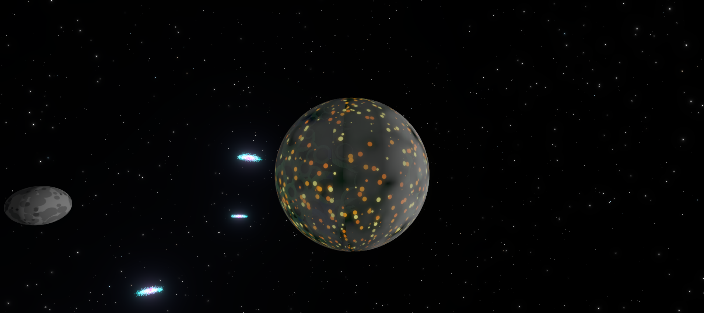

<h1 align="center">🌍 Cyber World</h1>
<p align="center">
<a href="https://github.com/Daniel-wambua/cyberworld"><br /></a>
<i>Cinematic 3D Earth visualization with infinite space exploration</i>
<br />
<i>Click Earth → Journey through procedurally generated galaxies</i>
<br />
<b>🚀 <a href="https://github.com/Daniel-wambua/cyberworld">Built with React Three Fiber + WebGL</a></b> <br />
</p>

## Motive
Why settle for static landing pages when you can have an **interactive 3D universe**?
Cyber World delivers a jaw-dropping cinematic experience that transforms your browser into a spaceship. Click the Earth and blast off through an **infinite procedurally generated cosmos**—new galaxies, nebulae, planets, and black holes spawn endlessly as you zoom. Built with cutting-edge WebGL and optimized for 60fps performance.

<details>
  <summary>About the Developer</summary>

> **Professional Background**<br>
> Passionate full stack developer specializing in WebGL, Three.js, and immersive web experiences. This project showcases advanced 3D rendering techniques, procedural generation, real-time audio synthesis, and performance optimization. Check out more work at the  [lab](https://lab.havocsec.me).

</details>

<details>
  <summary>Project Preview</summary>



</details>

---

## About

Cyber World is a React Three Fiber powered 3D visualization featuring a photorealistic Earth that launches you into an **infinite procedurally generated universe**. Click the planet to begin your journey through endless galaxies, black holes, and cosmic phenomena—all rendered in real-time.


**Tech Stack:**
- Vite 5.4 + React 18 + TypeScript 5
- Three.js 0.169 + React Three Fiber 8.17
- @react-three/drei 9.114 (OrbitControls)
- @react-three/postprocessing 2.16 (Bloom)
- GSAP 3.12 (smooth animations)
- Web Audio API (procedural sound synthesis)

---

## Quick Start

```bash
# Clone the repo
git clone https://github.com/Daniel-wambua/cyberworld.git
cd cyberworld

# Install dependencies
npm install

# Run dev server
npm run dev

```

Visit `http://localhost:3001` (or the port shown in terminal)

<details><summary>Deployment Options</summary>

**Vercel** (One-Click Deploy)

[](https://vercel.com/new/clone?repository-url=https://github.com/Daniel-wambua/cyberworld)

**Manual Deployment:**

- **Vercel**: `npm install -g vercel && vercel --prod`
- **Netlify**: `npm run build && netlify deploy --prod --dir=dist`
- **GitHub Pages**: `npm run build && npx gh-pages -d dist`
- **Docker**: `docker build -t cyberworld . && docker run -p 3000:3000 cyberworld`

</details>

---

## Usage

**How to Explore:**

| Action | Method | Result |
|--------|--------|--------|
| **Start Infinite Journey** | Click on Earth | Auto-zoom through endless procedural universe |
| **Stop Journey** | Click "Stop Journey" button | Return to manual controls |
| **Rotate Earth** | Left click + drag | Orbit around the planet |
| **Pan Camera** | Right click + drag | Move viewing position |
| **Manual Zoom** | Mouse wheel (when not auto-zooming) | Control zoom level manually |
| **Adjust Rotation** | Use rotation slider | Change Earth spin speed (0-5x) |
| **Fullscreen** | Click fullscreen button | Immersive full-screen mode |


**Project Structure:**
```
src/
├── App.tsx                    # Main application (all components)
│   ├── createEarthTexture()   # 4K procedural Earth texture
│   ├── createNightTexture()   # City lights map
│   ├── createNormalMap()      # Terrain elevation
│   ├── createCloudTexture()   # Animated clouds
│   ├── Earth()                # Main Earth mesh
│   ├── Moon()                 # Orbiting moon
│   ├── StarField()            # 15,000 stars
│   ├── Galaxy()               # Spiral galaxy generator
│   ├── SurroundingGalaxies()  # 8 static galaxies
│   ├── ProceduralGalaxies()   # Infinite galaxy spawning
│   ├── ProceduralNebulae()    # Infinite nebula generation
│   ├── ProceduralPlanets()    # Infinite planet spawning
│   ├── ProceduralBlackHoles() # Infinite black hole generation
│   ├── BlackHole()            # Static black hole
│   ├── WormholeEffect()       # Tunnel visualization
│   ├── CameraController()     # Zoom & animation system
│   ├── SoundManager()         # Web Audio API controller
│   └── Controls()             # UI controls
├── main.tsx                   # React entry point
├── index.css                  # Global styles
└── vite-env.d.ts             # TypeScript definitions
```

---

## Architecture

```
Click Earth → Auto-Zoom Activates → Procedural Generation
                                            ↓
                      Galaxy Spawner (every 20 units)
                      Nebula Spawner (every 30 units)
                      Planet Spawner (every 25 units)
                      Black Hole Spawner (every 40 units)
                                            ↓
                      Web Audio Intensifies with Depth
                                            ↓
                      Infinite Universe (no limits)
```

**How It Works:**
```
1. Initial load → Render Earth + Moon + 15,000 stars + 8 static galaxies
2. User clicks Earth → autoZoom = true, zoom level increments
3. At zoom > 50 → Deep space mode activates
4. Procedural spawning begins:
   - Math.floor(zoomLevel / 20) galaxies
   - Math.floor(zoomLevel / 30) nebulae
   - Math.floor(zoomLevel / 25) planets
   - Math.floor(zoomLevel / 40) black holes
5. Audio system adjusts frequencies based on zoom level
6. User clicks "Stop" → autoZoom = false, controls re-enabled
```

**Procedural Generation Formula:**
- **Galaxies**: Base 8 + floor(|zoomLevel| / 20) → At zoom 100: 8 + 5 = 13 galaxies
- **Nebulae**: Base 5 + floor(|zoomLevel| / 30) → At zoom 120: 5 + 4 = 9 nebulae
- **Planets**: Base 5 + floor(|zoomLevel| / 25) → At zoom 100: 5 + 4 = 9 planets
- **Black Holes**: Base 2 + floor(|zoomLevel| / 40) → At zoom 120: 2 + 3 = 5 black holes

---

**Dynamic Effects:**
- Frequencies modulate during infinite zoom
- Gain adjusts based on `Math.min(zoomLevel / 100, 1)`
- All sounds generated via Web Audio API (no files needed)

---

## 🎨 Visual Features

### Earth Rendering
- **4096×2048 procedural textures** (day map with oceans/continents)
- **2000+ city lights** on night side with glow
- **Normal mapping** for terrain depth
- **Cloud layer** with independent rotation
- **Day/night shader** blending based on sun position

### Space Objects
- **Moon**: 8-unit orbital radius, elliptical path, crater texture
- **Stars**: 15,000 points with size/color variation
- **Galaxies**: 5,000 particles per galaxy, spiral arm distribution
- **Nebulae**: Volumetric spheres with additive blending
- **Planets**: Randomized sizes (0.5-2 units), 7 color variations
- **Black Holes**: Event horizon + spinning accretion disk + point light

### Post-Processing
- **Bloom effect** (intensity 1.5, threshold 0.2)
- **Fog** (near 30, far 120) for atmospheric depth
- **Smooth animations** via GSAP easing

---

## 🚀 Performance

- **60 FPS target** maintained with thousands of objects
- **Efficient particle systems** using BufferGeometry
- **Procedural generation** only spawns visible/relevant objects
- **Smart culling** via Three.js frustum culling
- **Optimized textures** using canvas generation (no image files)
- **React Three Fiber** reconciliation for efficient updates

---

## License

> _**[Daniel-wambua/cyberworld](https://github.com/Daniel-wambua/cyberworld)** is licensed under [MIT](https://github.com/Daniel-wambua/cyberworld/blob/HEAD/LICENSE) © 2025._<br>
> <sup align="right">For information, see <a href="https://tldrlegal.com/license/mit-license">TLDR Legal > MIT</a></sup>

<details>
<summary>Expand License</summary>

```
The MIT License (MIT)
Copyright (c) 2025

Permission is hereby granted, free of charge, to any person obtaining a copy 
of this software and associated documentation files (the "Software"), to deal 
in the Software without restriction, including without limitation the rights 
to use, copy, modify, merge, publish, distribute, sub-license, and/or sell 
copies of the Software, and to permit persons to whom the Software is furnished 
to do so, subject to the following conditions:

The above copyright notice and this permission notice shall be included in all 
copies or substantial portions of the Software.

THE SOFTWARE IS PROVIDED "AS IS", WITHOUT WARRANTY OF ANY KIND, EXPRESS OR IMPLIED,
INCLUDING BUT NOT LIMITED TO THE WARRANTIES OF MERCHANTABILITY, FITNESS FOR A
PARTICULAR PURPOSE AND NON INFRINGEMENT. IN NO EVENT SHALL THE AUTHORS OR COPYRIGHT
HOLDERS BE LIABLE FOR ANY CLAIM, DAMAGES OR OTHER LIABILITY, WHETHER IN AN ACTION
OF CONTRACT, TORT OR OTHERWISE, ARISING FROM, OUT OF OR IN CONNECTION WITH THE
SOFTWARE OR THE USE OR OTHER DEALINGS IN THE SOFTWARE.
```

</details>

---

<!-- License + Copyright -->
<p align="center">
  <i>© 2025</i><br>
  <i>Licensed under <a href="https://opensource.org/licenses/MIT">MIT</a></i><br>
  <a href="https://github.com/Daniel-wambua"></a><br>
  <sup>Thanks for exploring the cosmos :)</sup>
</p>

<!-- ASCII Art -->
<!-- 
                    🌍 Cyber World 🌍
                    
              .-''''-.
            .'        '.
           /   O    O   \
          :                :
          |                |      "Journey to infinity!"
          :       \/       :
           \   ~~~~~~~~   /
            '.          .'
              '-......-'
                 ║║║║
               ═╩╩╩╩═
         
    ~~~~~~~~~~~~~~~~~~~~~~~~~~~~~~~~~~~
       I N F I N I T E   S P A C E
    ~~~~~~~~~~~~~~~~~~~~~~~~~~~~~~~~~~~
-->
